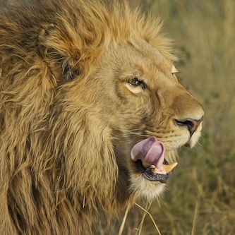

[](https://travis-ci.org/abraia/abraia-python)
[](https://coveralls.io/github/abraia/abraia-python?branch=develop)

# Abraia API client for Python

Python client for the [Abraia](https://abraia.me) API, used to smartly
transform and optimize (compress) images on-line. Read more at
[https://abraia.me/docs](https://abraia.me/docs).

Optimize images for Web with no quality damage based on perception-driven
technology.

* Optimal image compression with our perceptual adjustment to preserve the
quality and maximize the compression.
* Smart crop and resize images with our saliency and aesthetic based model
which balances between content and aesthetics.

```
abraia optimize --width 800 --height 400 https://images.pexels.com/photos/700948/pexels-photo-700948.jpeg images/skater.jpg
```


The example takes an [image by Willian Was from Pexels](https://www.pexels.com/photo/f-s-flip-700948/)
with a size of 4865x3321 pixels and a weight of 10.1MB and automatically
generates a header of 800x400 pixels cropping, resizing, and optimizing the
image to directly be used on Web.

## Installation

The Abraia python client works in Windows, Mac, and Linux with Python 2 and 3
(python>=2.6.5).

Install the API client and the CLI with a simple command:

```
pip install -U abraia
```

Verify that the abraia CLI is correctly installed:

```
abraia --version
```

## Configuration

For configuration you just need to [create a free account](https://abraia.me/login)
and introduce the API KEYS using the command bellow:

```
abraia configure
```

## Usage

### API usage:

The fluent design of the Abraia API makes easy to compress and transform
images. You just need to define the source of the image, the transformation
operation, and the sink for the resultant image.

```python
import abraia

abraia.from_file('images/lion.jpg').resize(
    width=600, height=600).to_file('images/lion_600x600.jpg')
abraia.from_url('https://abraia.me/images/random.jpg').resize(
    width=600, height=400).to_file('images/random_600x400.jpg')
```

### CLI usage:

With the CLI tool you can compress and optimize all the images in a folder with
a simple command:

```
abraia optimize images
```


Or you can resize and [automatically crop](https://abraia.me/docs/smartcrop)
all your images and folders, just adding the image size parameters:

```
abraia optimize --width 500 images/lion.jpg images/resized.jpg
abraia optimize --width 333 --height 333 images/lion.jpg images/cropped.jpg
```




## License

This software is licensed under the MIT License. [View the license](LICENSE).
